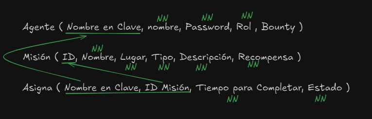

# AGENTES Y MISIONES

## Descripción

Esta API REST consiste en una serie de Agentes a los que se les asignan misiones. Los agentes tendrán que completar 
las misiones a contra-reloj para poder cobrar la recompensa.

## Justificación

Esta API REST puede ser usada tanto por organizaciones que velan por la paz como los Vengadores o los X-men como una empresa que quiere 
asignar tareas críticas a sus empleados. Por ejemplo cada empleado tiene una tarea que realizar y si consigue completarla en el tiempo indicado
consigue una recompensa.
También puede ser usada con fines educativos, recibiendo los estudiantes tareas o proyectos que tienen que completar para obtener recompensas
académicas.

## Entidad Relación 

## Paso a tablas

## Tablas

Agente: El agente tiene un nombre, nombre en clave ( ID ), rol ( Warlord o Agente ), password y bounty ( bounty seria el dinero total de las misiones realizadas ).

Misiones: La misión tiene un ID, nombre de misión, lugar, tipo de misión ( Enumerado que define el tipo de misión: RESCATE, RECONOCIMIENTO, SABOTAJE, ASALTO ), descripcion de la misión y la recompensa.

Asignacion-mision-agente: La asignacion tiene un agente, una mision, tiempo para completarla y un estado ( Enumerado que define el estado de la misión, completada, en proceso, mision fallida ).

### Agente
    nombre: String
    nombreEnClave: String ( id )
    password: String
    rol: String
    bounty: double

### Misiones
    id: Long
    nombre: String
    lugar: String
    tipo: Enum (?)
    descripcion: String
    recompensa: double

### Asignacion
    agente: Agente
    mision: Mision
    tiempoParaCompletarla: (por determinar)
    estado: Enum (?)

## Lógica de negocio y Restricciones semánticas

Un agente puede participar en varias misiones, si tiene una misión asignada no puede hacer otra.

A una misión solo se le asigna un agente, si el agente está en una misión no puede ser asignado.

Si un agente consigue completar la misión, se queda con la recompensa.

Si pasa el tiempo de la misión y no ha sido completada, pasa automaticamente a misión fallida.

Si la asignación se completa, la misión se borra de la lista de misiones.

Un Agente se convierte en Warlord cuando tiene un Bounty mayor que 1.000.000 de $.

El nombre en clave del Agente es único.

Las contraseñas deben de ser de 3 carácteres a 15.

Cuando se asigna una misión, su estado es por defecto EN_CURSO.

Cuando se registra un Agente, su bounty es 0.

# Endpoints

## Endpoints para AGENTES

* `POST /agentes/login`: Permite acceder al agente al sistema.
  - Ruta pública, todas las peticiones se permiten.
  - Entrada: JSON con nombre de agente y password.
  - Salida: Token de agente si accede correctamente.
  * Excepciones
    * 401 Bad Request: Si escribes mal el agente o contraseña.
  

* `POST /agentes/register`: Permite al agente registrarse en el sistema
  - Ruta pública, todas las peticiones se permiten.
  - Entrada: JSON con nombre de agente, nombre, password y rol (Warlord, Agente).
  - Salida: JSON con el agente registrado.
  * Excepciones
    * 401 Bad Request: Si el formato de la contraseña es incorrecto o si el agente ya está repetido.

* `GET /agentes/`: Permite ver al warlord todos los agentes y su información.
  - Ruta privada, solo las peticiones de rol Warlord podrán permitirse.
  - Entrada: Vacía.
  - Salida: Listado de todos los agentes en formato JSON.
  * Excepciones
    * 403 Forbidden: Si intenta acceder un agente que no es Warlord.

  

* `GET /agentes/{nombreClave}`: Permite ver al agente su información.
  - Ruta privada, solo podrá admitirse la petición al agente que tenga su mismo nombre en clave o al Warlord.
  - Entrada: Path variable del nombre en clave.
  - Salida: JSON con la información del agente que se ha pasado el nombre por ruta.

* `PUT /agentes/{nombreClave}`: Actualizar la información del agente.
  - Ruta privada, solo podrá actualizar el Warlord o el agente con el mismo nombre.
  - Entrada: Path Variable de nombre en clave más un JSON con los nuevos datos del agente.
  - Salida: JSON con los datos actualizados del agente.
  * Excepciones
    * 403 Forbidden: Si intenta acceder alguien que no tiene el mismo nombre que el token que pasa, o si no es Warlord.

* `DELETE /agentes/{nombreClave}`: Eliminar agente.
  - Ruta privada, solo el Warlord podrá eliminar al agente.
  - Entrada: Path Variable del nombre clave del agente.
  - Salida: JSON del agente eliminado.
  * Excepciones
    * 403 Forbidden: Si intenta eliminar un agente cualquiera que no sea Warlord.

## Endpoints para MISIONES

* `POST /misiones/`: Ingresar misiones en el sistema.
  - Ruta pública, todas las peticiones autenticadas se permiten.
  - Entrada: JSON con nombre, lugar, tipo ( RESCATE, RECONOCIMIENTO, SABOTAJE, ASALTO ), descripción y recompensa.
  - Salida: JSON con la información de la misión.
  * Excepciones
    * 401 Unauthorized: Si no está autenticado.

* `GET /misiones/`: Obtener todas las misiones en el sistema.
  - Ruta pública, todas las peticiones autenticadas se permiten.
  - Entrada: Vacía.
  - Salida: JSON con todas las misiones.
  * Excepciones
    * 401 Unauthorized: Si no está autenticado.

* `PUT /misiones/{nombre}`: Actualizar información de la misión.
  - Ruta privada, solo el Warlord podrá actualizar la misión.
  - Entrada: Path Variable con el nombre de la misión que se quiere actualizad y un JSON con los datos actualizados.
  - Salida: JSON con los datos de la misión actualizados.
  * Excepciones
    * 403 Forbidden: Solo el Warlord puede actualizar la misión.

* `DELETE /misiones/{nombre}`: Eliminar misión.
  - Ruta privada, solo el Warlord podrá eliminar las misiones.
  - Entrada: Path Variable con el nombre de la misión.
  - Salida: JSON con los datos de la misión eliminada.
  * Excepciones
    * 403 Forbidden: Solo el Warlord puede eliminar la misión.

## Endpoints para Asignaciones

* `POST /asignaciones/`: Asignar una misión a un agente.
  - Ruta privada, solo el Warlord asigna misiones a agentes.
  - Entrada: Request Body con el nombre del agente y el nombre de la misión.
  - Salida: JSON con los datos de la asignación. Nombre en Clave del agente, nombre de la misión, tiempo para completarla y estado.
  * Excepciones
    * 403 Forbidden: Solo el Warlord puede asignar la misión.
    * 406 Not Acceptable: Este agente ya tiene una misión asignada.

* `GET /asignaciones/`: Ver todas las asignaciones agente-misión.
  - Ruta pública, se aceptan peticiones de agentes autenticados.
  - Entrada: Vacía.
  - Salida: Lista de todas las asignaciones en formato JSON.
  * Excepciones
    * 401 Unauthorized: Si no está autenticado.

* `GET /asignaciones/{nombreClave}`: ver todas las asignaciones del agente pasado por la ruta.
  - Ruta pública, se aceptan peticiones de agentes autenticados.
  - Entrada: Path Variable con el nombre clave del agente.
  - Salida: Lista de todas las asignaciones que ha tenido el agente en formato JSON.
  * Excepciones
    * 401 Unauthorized: Si no está autenticado.

* `PUT /asignaciones/{idAsignacion}`: Actualizar la asignación mediante su id.
  - Ruta privada, solo el Warlord puede actualizar la misión.
  - Entrada: Path Variable con el ID de la asignación.
  - Salida: JSON con la asignación actualizada.
  * Excepciones
    * 403 Forbidden: Solo el Warlord puede actualizar la asignación.

* `DELETE /asignaciones/{idAsignacion}`: Eliminar asignación.
  - Ruta privada, solo el Warlord puede actualizar la misión.
  - Entrada: Path Variable con el ID de la asignación.
  - Salida: JSON con la asignación eliminada.
  * Excepciones
    * 403 Forbidden: Solo el Warlord puede eliminar una asignación.

  